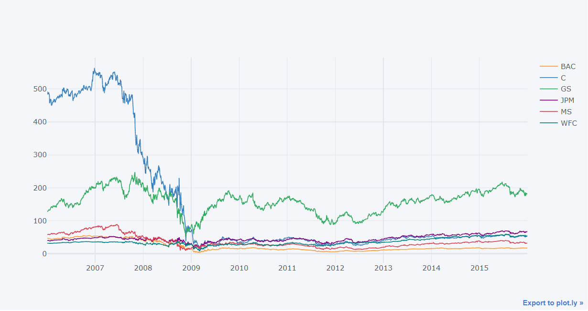
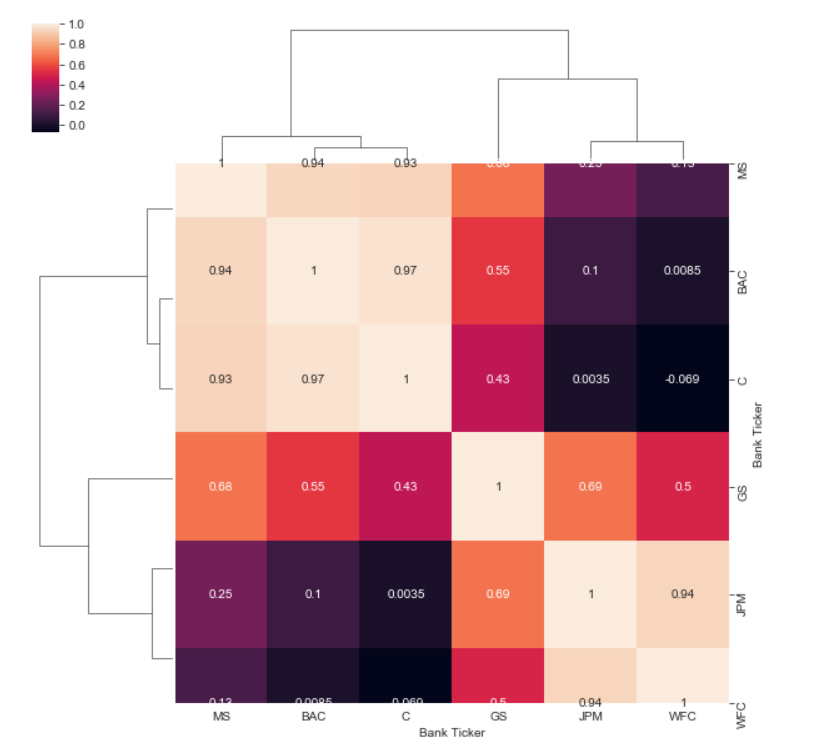
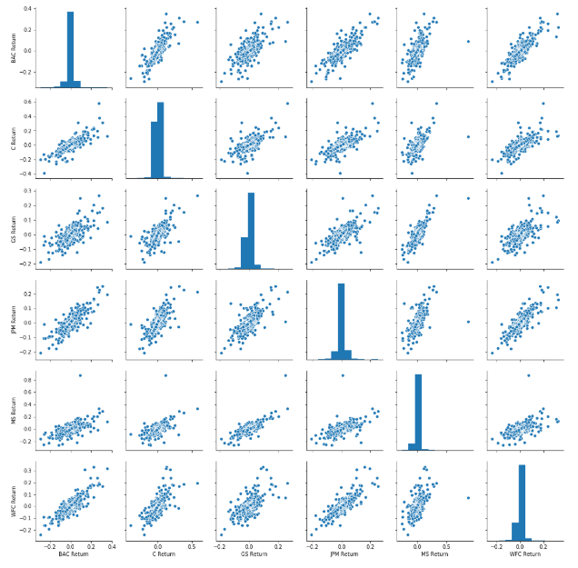
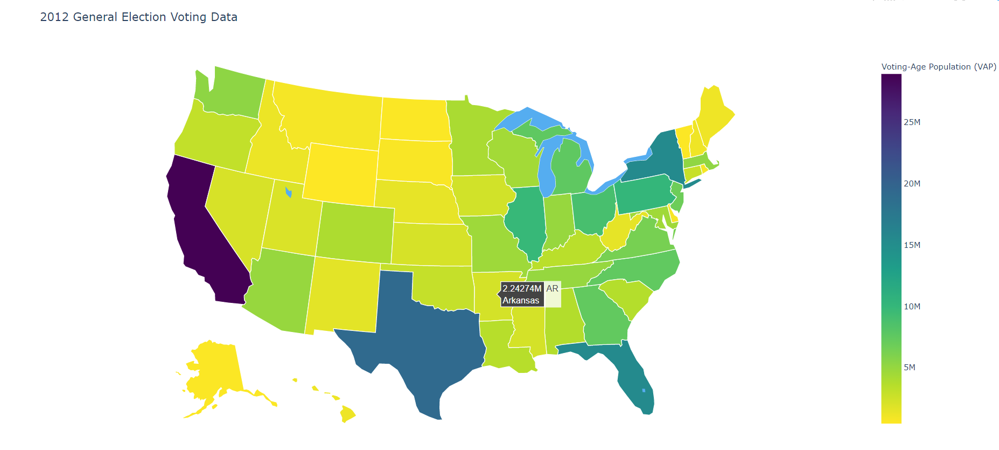

<link rel="stylesheet" type="text/css" href="data.css" />

<h1> Data Analysis </h1>

In this first part, data visualizations and analysis were practiced. For this purpose, following tools were used:

<ul> 
<li> Pandas </li>
<li> Seaborn </li>
<li> Matplotlib </li>
<li> Plotly </li>
<li> Choropleth Maps </li>
</ul>

Some examples:

<figure>

  <h6 style="text-align:center;"><em> Stock prices for given banks by using plotly  </em></h6>
</figure>

<figure>

  <h6 style="text-align:center;"> <em>Correlation between given banks by using seaborn</em>  </h6>
</figure>

<figure>

  <h6 style="text-align:center;"> <em>Seaborn pairplot </em> </h6>
</figure>

<figure>

  <h6 style="text-align:center;"> <em>Choropleth map displaying Voting-Age Population per state </em> </h6>
</figure>
