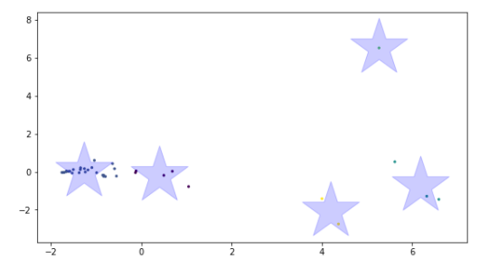

<h2> K-means Clustering </h2>

K- means clustering is a simple and elegant approach for partioning a data set into K distinct, non-overlapping clusters. To perform K-means clustering, we must first specify the desired number of clusters K; then the K-means algorithm will assign each observation to exactly one of the K clusters. Figure shows the results obtained from performing K-means clustering on a simulated example consisting of 38 observations in two dimensions, using five as value of K.

</img>

The K-means clustering procedure results from a simple and intuitive mathematical problem. Let <math>C1 </math>,...,<math>CK</math> denote sets containing the indices of the observations in each cluster. These sets satisfy two properties:

<ol>
<li> <math> C1&#x222A;C2&#x222A;...&#x222A;CK = {1,...,n}</math>. In other words, each observation belongs to at least one of the K clusters.
</li>
<li><math>CK&#x22C2;CK' = &#x2205;</math> for all <math>k &#x2260;k'</math>. In other words, the clusters are non-overlapping: no observation belongs to more than one cluster.
</li>
</ol>

The idea behind K-means clustering is that a good clustering is one for which the within-cluster variation is as small as possible.  

<h3> K-means Clustering Algorithm </h3>

<ol>
<li>Randomly assign a number, from 1 to K, to each of the observations. These serve as initial cluster assignments for the observations.
</li>
<li>Iterate until the cluster assignments stop changing:
<ol type="a">
<li>For each of the K clusters, compute the cluster centroid. The kth cluster centroid is the vector of the p feature means for the observations in the kth cluster.
</li>
<li>Assign each observation to the cluster whose centeroid is closest (where closest is defined using Euclidean distance).
</li>
</ol>
</li>
</ol>

<em>* Source: James, Gareth, et al. An introduction to statistical learning.(Vol. 112, p. 386). New York: springer, 2013. </em>
