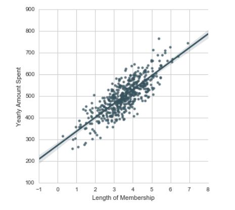

<link rel="stylesheet" type="text/css" href="data.css" />
<h1> Linear Regression Project </h1>
This project is for an Ecommerce company based in New York City that sells clothing online but they also have in-store style and clothing advise sessions. Customers come in to the store, have sessions/meetings with a personal stylist, then they can go home and order either on a mobile app or website for the clothes they want.
The company is trying to decide whether to focus their efforts on their mobile app experience or their website.
 </img>
<h1> Simple Linear Regression </h1>

<em> Simple linear regression </em> lives up to its name: it is a very straightforward approach for predicting a quantitative response<em> Y </em> on the basis of a single predictor variable <em> X</em>. It assumes that there is approximately a linear relationship between <em> X </em> and <em> Y </em>. Mathematically, we can write this linear relationship as 

<math>
		Y  ≈ &#946;0 + &#946;1 X  &emsp;&emsp;&emsp;&emsp;&emsp;&emsp;&emsp;&emsp;  (1)
</math>

In equation (1), <math>&#946;0 </math> and <math>&#946;1 </math> are two unknown constants that represents the intercept and slope terms in the linear model. Together, <math>&#946;0 </math> and <math>&#946;1 </math> are known as the model <em> coefficients </em> or <em> parameters </em>. So before we can use (1) to make predictions, we must use data to estimate the coefficients. Let

<math>
	(x1, y1), (x2, y2),..., (xn, yn)
</math>

represent n observation pairs, each of which consists of a measurement of X and a measurement of Y. Our goal is to obtain coefficient estimates <math>&#946;'0 </math>  and <math>&#946;'1</math> such that the linear model (1) fits the available data well-that is, so that <math>yi ≈ <math>&#946;'0 </math> +  <math>&#946;'1 xi</math> 	</math> for <em>1,...,n </em>.

<h3> Regression Evaluation Metrics</h3>    
Here are three common evaluation metrics for regression problems:

<strong>Mean Absolute Error </strong> (MAE) is the mean of the absolute value of the errors:

<math>
1/n &sum;i=1n  |yi - y'i|
</math>

<strong>Mean Squared Error </strong> (MSE) is the mean of the squared errors:

<math>
1/n &sum;i=1n  (yi - y'i)2
</math>

<strong>Root Mean Squared Error </strong> (RMSE) is the square root of the mean of the squared errors:

<math>
&#8730;1/n &sum;i=1n  (yi - y'i)2
</math>

Comparing these metrics:
<ul>
<li><strong> MAE</strong> is the easiest to understand, because it's the average error.</li>
<li><strong>MSE</strong> is more popular than MAE, because MSE "punishes" larger errors, which tends to be useful in the real world.  </li>
<li><strong> RMSE</strong> is even more popular than MSE, because RMSE is interpretable in the "y" units.</li>
</ul>
All of these are <strong>loss functions</strong>, because we want to minimize them.

<em>* Source: James, Gareth, et al. An introduction to statistical learning.(Vol. 112, p. 61). New York: springer, 2013. </em>
