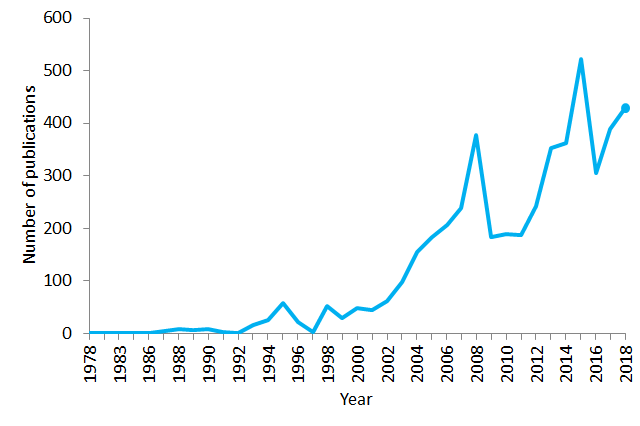
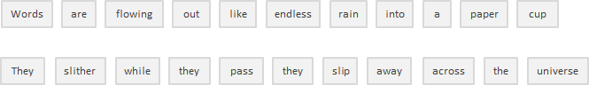
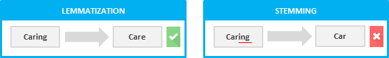

<h1> Natural Language Processing (NLP) </h1>

Data generated from conversations, declarations or even tweets are examples of unstructured data. <strong>Unstructured data</strong> doesn’t fit neatly into the traditional row and column structure of relational databases, and represent the vast majority of data available in the actual world. It is messy and hard to manipulate. Nevertheless, thanks to the advances in disciplines like machine learning a big revolution is going on regarding this topic. Nowadays it is no longer about trying to interpret a text or speech based on its keywords (the old fashioned mechanical way), but about understanding the meaning behind those words (the cognitive way). This way it is possible to detect figures of speech like irony, or even perform sentiment analysis.

Natural Language Processing or NLP is a field of Artificial Intelligence that gives the machines the ability to read, understand and derive meaning from human languages. It is a discipline that focuses on the interaction between data science and human language, and is scaling to lots of industries. Today NLP is booming thanks to the huge improvements in the access to data and the increase in computational power, which are allowing practitioners to achieve meaningful results in areas like healthcare, media, finance and human resources, among others.

<h1> Use Cases of NLP</h1>
In simple terms, NLP represents the automatic handling of natural human language like speech or text, and although the concept itself is fascinating, the real value behind this technology comes from the use cases.

NLP can help you with lots of tasks and the fields of application just seem to increase on a daily basis. Let’s mention some examples:

<ul>
<li>
NLP enables the recognition and <strong>prediction of diseases</strong> based on electronic health records and patient’s own speech. This capability is being explored in health conditions that go from cardiovascular diseases to depression and even schizophrenia. For example, Amazon Comprehend Medical is a service that uses NLP to <u>extract disease conditions</u>, medications and treatment outcomes from patient notes, clinical trial reports and other electronic health records.
</li>

<li>
Organizations can determine what customers are saying about a service or product by identifying and extracting information in sources like social media. This <strong><u>sentiment analysis</u></strong> can provide a lot of information about customers choices and their decision drivers.
</li>
<li>
<u>An inventor at IBM developed a <strong>cognitive assistant</strong></u> that works like a personalized search engine by learning all about you and then remind you of a name, a song, or anything you can’t remember the moment you need it to.
</li>
<li>
Companies like Yahoo and Google filter and classify your emails with NLP by analyzing text in emails that flow through their servers and <strong>stopping spam</strong> before they even enter your inbox.
</li>
<li>
To help <strong>identifying fake news</strong>, the <u>NLP Group at MIT </u>developed a new system to determine if a source is accurate or politically biased, detecting if a news source can be trusted or not.
</li>
<li>
Amazon’s Alexa and Apple’s Siri are examples of intelligent <strong>voice driven interfaces</strong> that use NLP to respond to vocal prompts and do everything like find a particular shop, tell us the weather forecast, suggest the best route to the office or turn on the lights at home.
</li>
<li>
Having an insight into what is happening and what people are talking about can be very valuable to <strong><u>financial traders</u></strong>. NLP is being used to track news, reports, comments about possible mergers between companies, everything can be then incorporated into a trading algorithm to generate massive profits. Remember: buy the rumor, sell the news.
</li>
<li>
NLP is also being used in both the search and selection phases of <strong><u>talent recruitment</u></strong>, identifying the skills of potential hires and also spotting prospects before they become active on the job market.
</li>
<li>
Powered by IBM Watson NLP technology, <u>LegalMation</u> developed a platform to automate routine <strong>litigation tasks</strong> and help legal teams save time, drive down costs and shift strategic focus.
</li>
</ul>

NLP is particularly booming in the <strong>healthcare industry</strong>. This technology is improving care delivery, disease diagnosis and bringing costs down while healthcare organizations are going through a growing adoption of electronic health records. The fact that clinical documentation can be improved means that patients can be better understood and benefited through better healthcare. The goal should be to optimize their experience, and several organizations are already working on this.
 </img>
<h5 style="text-align:center;">Number of publications containing the sentence “natural language processing” in PubMed in the period 1978–2018. As of 2018, PubMed comprised more than 29 million citations for biomedical literature </h5>

Companies like Winterlight Labs are making huge improvements in the treatment of Alzheimer’s disease by monitoring cognitive impairment through speech and they can also support clinical trials and studies for a wide range of central nervous system disorders. Following a similar approach, Stanford University developed Woebot, a <strong>chatbot therapist</strong> with the aim of helping people with anxiety and other disorders.

But serious controversy is around the subject. A couple of years ago Microsoft demonstrated that by analyzing large samples of search engine queries, they could identify internet users who were suffering from pancreatic cancer even before they have received a diagnosis of the disease. How would users react to such diagnosis? And what would happen if you were tested as a false positive? (meaning that you can be diagnosed with the disease even though you don’t have it). This recalls the case of Google Flu Trends which in 2009 was announced as being able to predict influenza but later on vanished due to its low accuracy and inability to meet its projected rates.

NLP may be the key to an effective clinical support in the future, but there are still many challenges to face in the short term.
<h2> Bag of Words</h2>
Is a commonly used model that allows you to count all words in a piece of text. Basically it creates an occurrence matrix for the sentence or document, disregarding grammar and word order. These word frequencies or occurrences are then used as features for training a classifier.
To bring a short example I took the first sentence of the song “Across the Universe” from The Beatles:

Words are flowing out like endless rain into a paper cup,

They slither while they pass, they slip away across the universe

Now let’s count the words:

 </img>

This approach may reflect several downsides like the absence of semantic meaning and context, and the facts that stop words (like “the” or “a”) add noise to the analysis and some words are not weighted accordingly (“universe” weights less than the word “they”).

To solve this problem, one approach is to rescale the frequency of words by how often they appear in all texts (not just the one we are analyzing) so that the scores for frequent words like “the”, that are also frequent across other texts, get penalized. This approach to scoring is called “Term Frequency — Inverse Document Frequency” (TFIDF), and improves the bag of words by weights. Through TFIDF frequent terms in the text are “rewarded” (like the word “they” in our example), but they also get “punished” if those terms are frequent in other texts we include in the algorithm too. On the contrary, this method highlights and “rewards” unique or rare terms considering all texts. Nevertheless, this approach still has no context nor semantics.

<h2>Tokenization </h2>

Is the process of segmenting running text into sentences and words. In essence, it’s the task of cutting a text into pieces called <em>tokens</em>, and at the same time throwing away certain characters, such as punctuation. Following our example, the result of tokenization would be:

 </img>

Pretty simple, right? Well, although it may seem quite basic in this case and also in languages like English that separate words by a blank space (called segmented languages) not all languages behave the same, and if you think about it, blank spaces alone are not sufficient enough even for English to perform proper tokenizations. Splitting on blank spaces may break up what should be considered as one token, as in the case of certain names (e.g. San Francisco or New York) or borrowed foreign phrases (e.g. laissez faire).

Tokenization can remove punctuation too, easing the path to a proper word segmentation but also triggering possible complications. In the case of periods that follow abbreviation (e.g. dr.), the period following that abbreviation should be considered as part of the same token and not be removed.

The tokenization process can be particularly problematic when dealing with biomedical text domains which contain lots of hyphens, parentheses, and other punctuation marks.

<h2>Stop Words Removal </h2>
Includes getting rid of common language articles, pronouns and prepositions such as “and”, “the” or “to” in English. In this process some very common words that appear to provide little or no value to the NLP objective are filtered and excluded from the text to be processed, hence removing widespread and frequent terms that are not informative about the corresponding text.

Stop words can be safely ignored by carrying out a lookup in a pre-defined list of keywords, freeing up database space and improving processing time.

<strong>There is no universal list of stop words.</strong> These can be pre-selected or built from scratch. A potential approach is to begin by adopting pre-defined stop words and add words to the list later on. Nevertheless it seems that the general trend over the past time has been to go from the use of large standard stop word lists to the use of no lists at all.

The thing is stop words removal can wipe out relevant information and modify the context in a given sentence. For example, if we are performing a sentiment analysis we might throw our algorithm off track if we remove a stop word like “not”. Under these conditions, you might select a minimal stop word list and add additional terms depending on your specific objective.

<h2> Stemming </h2>

Refers to the process of slicing the end or the beginning of words with the intention of removing affixes (lexical additions to the root of the word).

The problem is that affixes can create or expand new forms of the same word (called inflectional affixes), or even create new words themselves (called derivational affixes). In English, prefixes are always derivational (the affix creates a new word as in the example of the prefix “eco” in the word “ecosystem”), but suffixes can be derivational (the affix creates a new word as in the example of the suffix “ist” in the word “guitarist”) or inflectional (the affix creates a new form of word as in the example of the suffix “er” in the word “faster”).

Ok, so how can we tell the difference and chop the right bit?

 </img>

A possible approach is to consider a list of common affixes and rules (Python and R languages have different libraries containing affixes and methods) and perform stemming based on them, but of course this approach presents limitations. Since stemmers use algorithmics approaches, the result of the stemming process may not be an actual word or even change the word (and sentence) meaning. To offset this effect you can edit those predefined methods by adding or removing affixes and rules, but you must consider that you might be improving the performance in one area while producing a degradation in another one. Always look at the whole picture and test your model’s performance.

So if stemming has serious limitations, why do we use it? First of all, it can be used to correct spelling errors from the tokens. <strong>Stemmers are simple to use and run very fast</strong> (they perform simple operations on a string), and if speed and performance are important in the NLP model, then stemming is certainly the way to go. Remember, we use it with the objective of improving our performance, not as a grammar exercise.

<h2> Lemmatization </h2>

Has the objective of reducing a word to its base form and grouping together different forms of the same word. For example, verbs in past tense are changed into present (e.g. “went” is changed to “go”) and synonyms are unified (e.g. “best” is changed to “good”), hence standardizing words with similar meaning to their root. Although it seems closely related to the stemming process, lemmatization uses a different approach to reach the root forms of words.

<em>Lemmatization resolves words to their dictionary form (known as lemma) for which it requires detailed dictionaries in which the algorithm can look into and link words to their corresponding lemmas.  </em>

For example, the words “running”, “runs” and “ran” are all forms of the word “run”, so “run” is the lemma of all the previous words.

 </img>

Lemmatization also takes into consideration the context of the word in order to <strong>solve other problems like disambiguation </strong>, which means it can discriminate between identical words that have different meanings depending on the specific context. Think about words like “bat” (which can correspond to the animal or to the metal/wooden club used in baseball) or “bank” (corresponding to the financial institution or to the land alongside a body of water). By providing a part-of-speech parameter to a word ( whether it is a noun, a verb, and so on) it’s possible to define a role for that word in the sentence and remove disambiguation.

As you might already pictured, lemmatization is a much more resource-intensive task than performing a stemming process. At the same time, since it requires more knowledge about the language structure than a stemming approach, it <strong>demands more computational power</strong> than setting up or adapting a stemming algorithm.

*Source: <a href="https://towardsdatascience.com/your-guide-to-natural-language-processing-nlp-48ea2511f6e1">https://towardsdatascience.com/your-guide-to-natural-language-processing-nlp-48ea2511f6e1</a> 