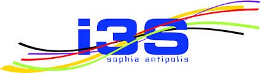
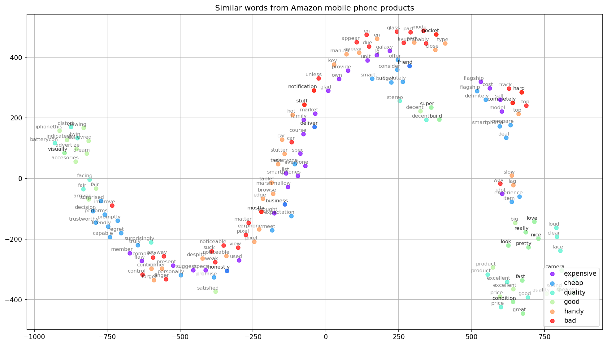
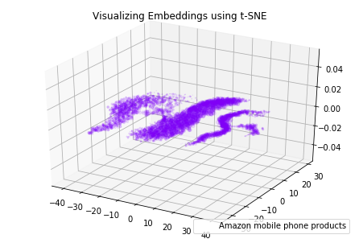
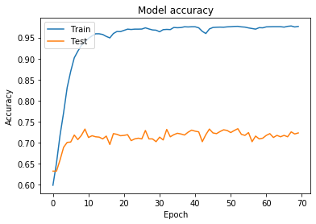
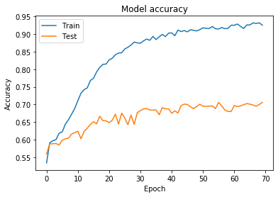

 </img>
 </img>
<h1> Impact of the word embedding
in an NLP Task</h1>

Word embedding helps us to obtain both the semantic and syntactic information of words from a large corpus. It is widely used in several Natural Language Processing (NLP) tasks. Different techniques for word embedding have been proposed to compute the word representations through neural network. This study aims to present these different approaches and to compare their performances. These performances are evaluated on one NLP task, while all the word embedding techniques are used on the same training data with the same vocabulary.

<h3>Methods </h3>
In order to transform words into numeric values, one of the simplest approaches is one-hot encoding in which each distinct word stands for one dimension of the resulting vector. Binary values are used to indicate the presence (1) or absence (0) of the word. However, one-hot encoding creates hundreds of thousands of dimensions when dialing with the entire vocabulary. Thus, this makes one-hot encoding impractical in comparison with word embedding. 
Unlike one-hot encoding, word embedding can represent words in vectors of numeric values with denser dimensions. Many different models were proposed to learn word vectors. The two main models of them are global matrix factorization (e.g., latent semantic analysis) and local context window methods (e.g., skip gram model).  They both rely on contextual information, as similar words may appear in the similar context. By using local context window methods, Mikolov et al.*  created Word2Vec toolkit which can be easily used to generate embeddings. 
<li>
Word2Vec
</li>
<li>
GLoVe
</li>

 </img>
 </img>
 </img>
<h6 style="text-align:center;"><em>Glove Accuracy</em></h6>
 </img>
<h6 style="text-align:center;"><em>Word2vec Accuracy</em></h6>
*<em>T. Mikolov, C. Kai, C. Greg and D. Jeffrey, "Efficient estimation of word representations in vector space," arXiv preprint arXiv:1301.3781, 2013. </em>