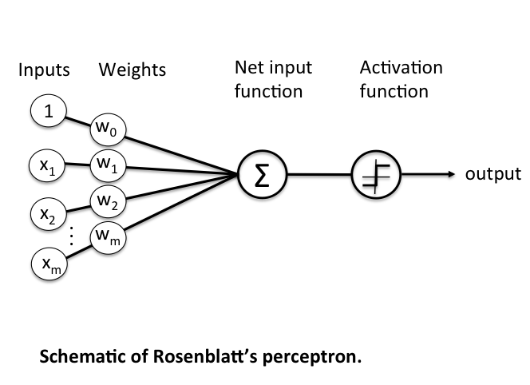
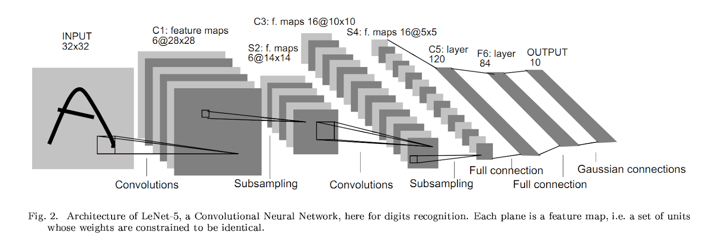
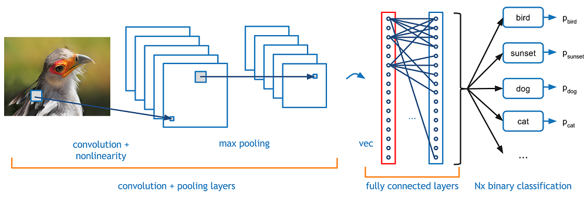
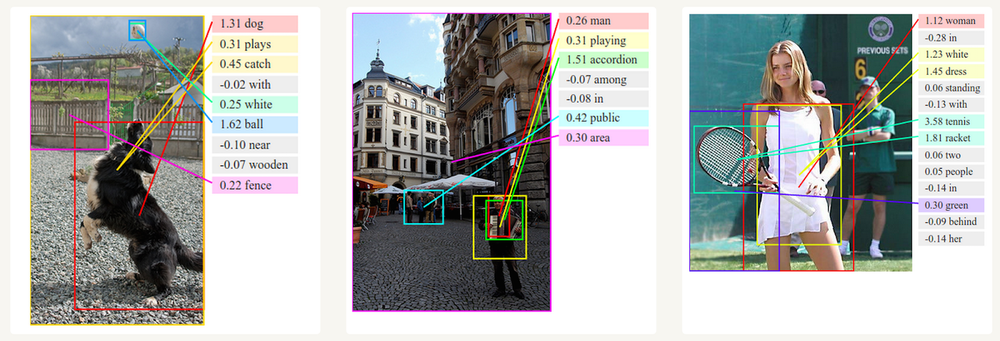
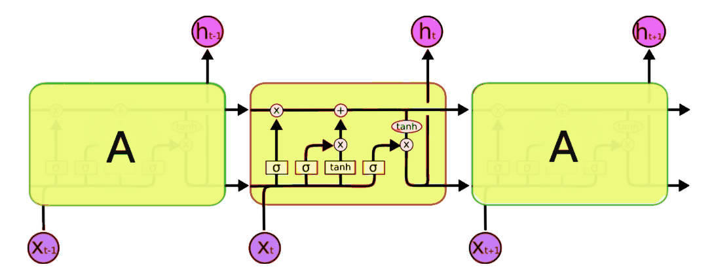

<h2> Neural Networks </h2>

Neural Networks are a class of models within the general machine learning literature. Neural networks are a specific set of algorithms that have revolutionized machine learning. They are inspired by biological neural networks and the current so-called deep neural networks have proven to work quite well. Neural Networks are themselves general function approximations, which is why they can be applied to almost any machine learning problem about learning a complex mapping from the input to the output space.

<h3> Neural Network Architectures </h3>

<h4>1. Perceptrons </h4>

Considered the first generation of neural networks, perceptrons are simply computational models of a single neuron. Perceptron was originally coined by Frank Rosenblatt. Also called feed-forward neural network, a perceptron feeds information from the front to the back. Training perceptrons usually require back-propagation, giving the network paired datasets of inputs and outputs. Inputs are sent into the neuron, processed, and result in an output. The error that is back propagated is usually the difference between the input and the output data. If the network has enough hidden neurons, it can always model the relationship between the input and output. Practically, their use is a lot more limited, but they are popularly combined with other networks to form new networks. 

</img>

If you choose features by hand and have enough , you can do almost anything. For binary input vectors, we can have a separate feature unit for each of the exponentially many binary vectors and we can make any possible discrimination for binary input vectors. However, perceptrons do have limitations: once the hand-coded features have been determined, there are very strong limitations on what a perceptron can learn.

<h4>2. Convolutional Neural Networks </h4>

In 1998, Yann LeCun and his collaborators developed a really good recognizer for handwritten digits called LeNet. It used back-propagation in a feedforward net with many hidden layers, many maps of replicated units in each layer, output pooling of nearby replicated units, a wide net that can cope with several characters at once, even if they overlap, and a clever way of training a complete system, not just a recognizer. It was later formalized under the name convolutional neural networks (CNNs).

</img>

Convolutional neural networks are quite different from most other networks. They are primarily used for image processing, but can also be used for other types of input, such as as audio. A typical use case for CNNs is where you feed the network images and it classifies the data. CNNs tend to start with an input “scanner,” which is not intended to parse all of the training data at once. For example, to input an image of 100 x 100 pixels, you wouldn’t want a layer with 10,000 nodes. Rather, you create a scanning input layer of say, 10 x 10, and you feed the first 10 x 10 pixels of the image. Once you’ve passed that input, you feed it the next 10 x 10 pixels by moving the scanner one pixel to the right.

</img>

This input data is then fed through convolutional layers instead of normal layers, where not all nodes are connected. Each node only concerns itself with close neighboring cells. These convolutional layers also tend to shrink as they become deeper, mostly by easily divisible factors of the input. Beside these convolutional layers, they also often feature pooling layers. Pooling is a way to filter out details: a commonly found pooling technique is max pooling, where we take, say, 2 x 2 pixels and pass on the pixel with the most amount of red. If you want to dig deeper into CNNs, read Yann LeCun’s original paper, “Gradient-based learning applied to document recognition” (1998).

<h4>2. Recurrent Neural Networks </h4>

To understand RNNs, we need to have a brief overview of sequence modeling. When applying machine learning to sequences, we often want to turn an input sequence into an output sequence that lives in a different domain. For example, turn a sequence of sound pressures into a sequence of word identities. When there is no separate target sequence, we can get a teaching signal by trying to predict the next term in the input sequence. The target output sequence is the input sequence with an advance of one step. This seems much more natural than trying to predict one pixel in an image from the other pixels, or one patch of an image from the rest of the image. Predicting the next term in a sequence blurs the distinction between supervised and unsupervised learning. It uses methods designed for supervised learning but doesn’t require a separate teaching signal.

</img>

Memoryless models are the standard approach to this task. In particular, autoregressive models can predict the next term in a sequence from a fixed number of previous terms using “delay taps.” Feed-forward neural nets are generalized autoregressive models that use one or more layers of non-linear hidden units. However, if we give our generative model some hidden state, and if we give this hidden state its own internal dynamics, we get a much more interesting kind of model that can store information in its hidden state for a long time. If the dynamics and the way it generates outputs from its hidden state are noisy, we will never know its exact hidden state. The best we can do is infer a probability distribution over the space of hidden state vectors. This inference is only tractable for two types of hidden state models.

Originally introduced in Jeffrey Elman's “Finding structure in time” (1990) [3], recurrent neural networks (RNNs) are basically perceptrons. However, unlike perceptrons, which are stateless, they have connections between passes, connections through time. RNNs are very powerful, because they combine two properties: 1) a distributed hidden state that allows them to store a lot of information about the past efficiently and 2) non-linear dynamics that allow them to update their hidden state in complicated ways. With enough neurons and time, RNNs can compute anything that your computer can compute. So what kinds of behavior can RNNs exhibit? They can oscillate, settle to point attractors, and behave chaotically. They can potentially learn to implement lots of small programs that each capture a nugget of knowledge and run in parallel, interacting to produce very complicated effects.

</img>

One big problem with RNNs is the vanishing (or exploding) gradient problem, where, depending on the activation functions used, information rapidly gets lost over time. Intuitively, this wouldn’t be much of a problem because these are just weights and not neuron states, but the weights through time is actually where the information from the past is stored. If the weight reaches a value of 0 or 1,000,000, the previous state won’t be very informative. RNNs can, in principle, be used in many fields, as most forms of data that don’t actually have a timeline (non- audio or video) can be represented as a sequence. A picture or a string of text can be fed one pixel or character at a time, so time dependent weights are used for what came before in the sequence, not actually what happened x seconds before. In general, recurrent networks are a good choice for advancing or completing information, like autocompletion.

<h4> Long / Short Term Memory </h4>

Hochreiter & Schmidhuber (1997) solved the problem of getting a RNN to remember things for a long time by building what is known as long-short term memory networks (LSTMs). LSTMs try to combat the vanishing/exploding gradient problem by introducing gates and an explicitly defined memory cell. The memory cell stores the previous values and holds onto it unless a "forget gate" tells the cell to forget those values. LSTMs also have an "input gate" that adds new stuff to the cell and an "output gate" that decides when to pass along the vectors from the cell to the next hidden state.

</img>

Recall that with all RNNs, the values coming in from X_train and H_previous are used to determine what happens in the current hidden state. The results of the current hidden state (H_current) are used to determine what happens in the next hidden state. LSTMs simply add a cell layer to make sure the transfer of hidden state information from one iteration to the next is reasonably high. Put another way, we want to remember stuff from previous iterations for as long as needed, and the cells in LSTMs allow this to happen. LSTMs are able to learn complex sequences, such as Hemingway’s writing or Mozart’s music.

<em>*Source: <a href="https://www.codementor.io/@james_aka_yale/a-gentle-introduction-to-neural-networks-for-machine-learning-hkijvz7lp">https://www.codementor.io/@james_aka_yale/a-gentle-introduction-to-neural-networks-for-machine-learning-hkijvz7lp</a></em>