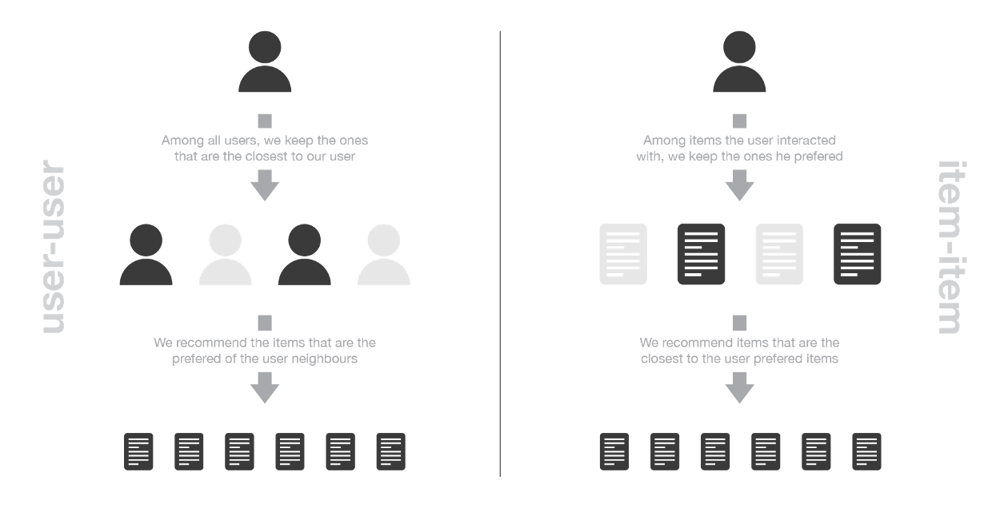

<h2> Recommender Systems </h2>

Recommender systems are algorithms aimed at suggesting relevant items to users (items being movies to watch, text to read, products to buy or anything else depending on industries).

Recommender systems are really critical in some industries as they can generate a huge amount of income when they are efficient or also be a way to stand out significantly from competitors. As a proof of the importance of recommender systems, we can mention that, a few years ago, Netflix organised a challenges (the “Netflix prize”) where the goal was to produce a recommender system that performs better than its own algorithm with a prize of 1 million dollars to win.

<h3> Collaborative versus content </h3>

The purpose of a recommender system is to suggest relevant items to users. To achieve this task, there exist two major categories of methods : collaborative filtering methods and content based methods. Before digging more into details of particular algorithms, let’s discuss briefly these two main paradigms.

<h4> Collaborative filtering methods </h4>
Collaborative methods for recommender systems are methods that are based solely on the past interactions recorded between users and items in order to produce new recommendations. These interactions are stored in the so-called “user-item interactions matrix”.

</img>
<h6 style="text-align:center;"><em> IIllustration of the user-item interactions matrix</em></h6> 

Then, the main idea that rules collaborative methods is that these past user-item interactions are sufficient to detect similar users and/or similar items and make predictions based on these estimated proximities.

The class of collaborative filtering algorithms is divided into two sub-categories that are generally called memory based and model based approaches. Memory based approaches directly works with values of recorded interactions, assuming no model, and are essentially based on nearest neighbours search (for example, find the closest users from a user of interest and suggest the most popular items among these neighbours). Model based approaches assume an underlying “generative” model that explains the user-item interactions and try to discover it in order to make new predictions.

</img>
<h6 style="text-align:center;"><em> Overview of the collaborative filtering methods paradigm</em></h6>

The main advantage of collaborative approaches is that they require no information about users or items and, so, they can be used in many situations. Moreover, the more users interact with items the more new recommendations become accurate: for a fixed set of users and items, new interactions recorded over time bring new information and make the system more and more effective.
However, as it only consider past interactions to make recommendations, collaborative filtering suffer from the “cold start problem”: it is impossible to recommend anything to new users or to recommend a new item to any users and many users or items have too few interactions to be efficiently handled. This drawback can be addressed in different way: recommending random items to new users or new items to random users (random strategy), recommending popular items to new users or new items to most active users (maximum expectation strategy), recommending a set of various items to new users or a new item to a set of various users (exploratory strategy) or, finally, using a non collaborative method for the early life of the user or the item.
In the following sections, we will mainly present three classical collaborative filtering approaches: two memory based methods (user-user and item-item) and one model based approach (matrix factorisation). 

<h4> Content based methods </h4>

Unlike collaborative methods that only rely on the user-item interactions, content based approaches use additional information about users and/or items. If we consider the example of a movies recommender system, this additional information can be, for example, the age, the sex, the job or any other personal information for users as well as the category, the main actors, the duration or other characteristics for the movies (items).
Then, the idea of content based methods is to try to build a model, based on the available “features”, that explain the observed user-item interactions. Still considering users and movies, we will try, for example, to model the fact that young women tend to rate better some movies, that young men tend to rate better some other movies and so on. If we manage to get such model, then, making new predictions for a user is pretty easy: we just need to look at the profile (age, sex, …) of this user and, based on this information, to determine relevant movies to suggest.

</img>
<h6 style="text-align:center;"><em> Overview of the content based methods paradigm</em></h6>

Content based methods suffer far less from the cold start problem than collaborative approaches: new users or items can be described by their characteristics (content) and so relevant suggestions can be done for these new entities. Only new users or items with previously unseen features will logically suffer from this drawback, but once the system old enough, this has few to no chance to happen.
Later in this post, we will further discuss content based approaches and see that, depending on our problem, various classification or regression models can be used, ranging from very simple to much more complex models.

<h4> Models, bias and variance </h4>

Let’s focus a bit more on the main differences between the previously mentioned methods. More especially let’s see the implication that the modelling level has on the bias and the variance.
In memory based collaborative methods, no latent model is assumed. The algorithms directly works with the user-item interactions: for example, users are represented by their interactions with items and a nearest neighbours search on these representations is used to produce suggestions. As no latent model is assumed, these methods have theoretically a low bias but a high variance.
In model based collaborative methods, some latent interaction model is assumed. The model is trained to reconstruct user-item interactions values from its own representation of users and items. New suggestions can then be done based on this model. The users and items latent representations extracted by the model have a mathematical meaning that can be hard to interpret for a human being. As a (pretty free) model for user-item interactions is assumed, this methods has theoretically a higher bias but a lower variance than methods assuming no latent model.
Finally, in content based methods some latent interaction model is also assumed. However, here, the model is provided with content that define the representation of users and/or items: for example, users are represented by given features and we try to model for each item the kind of user profile that likes or not this item. Here, as for model based collaborative methods, a user-item interactions model is assumed. However, this model is more constrained (because representation of users and/or items are given) and, so, the method tends to have the highest bias but the lowest variance.

</img>

<h3> Memory based collaborative approaches </h3>

The main characteristics of user-user and item-item approaches it that they use only information from the user-item interaction matrix and they assume no model to produce new recommendations.

<h4>User-user</h4>

In order to make a new recommendation to a user, user-user method roughly tries to identify users with the most similar “interactions profile” (nearest neighbours) in order to suggest items that are the most popular among these neighbours (and that are “new” to our user). This method is said to be “user-centred” as it represent users based on their interactions with items and evaluate distances between users.
Assume that we want to make a recommendation for a given user. First, every user can be represented by its vector of interactions with the different items (“its line” in the interaction matrix). Then, we can compute some kind of “similarity” between our user of interest and every other users. That similarity measure is such that two users with similar interactions on the same items should be considered as being close. Once similarities to every users have been computed, we can keep the k-nearest-neighbours to our user and then suggest the most popular items among them (only looking at the items that our reference user has not interacted with yet).
Notice that, when computing similarity between users, the number of “common interactions” (how much items have already been considered by both users?) should be considered carefully! Indeed, most of the time, we want to avoid that someone that only have one interaction in common with our reference user could have a 100% match and be considered as being “closer” than someone having 100 common interactions and agreeing “only” on 98% of them. So, we consider that two users are similar if they have interacted with a lot of common items in the same way (similar rating, similar time hovering…).

</img>
<h6 style="text-align:center;"><em> Illustration of the user-user method. The same colour code will be used in the remaining of the post.
</em></h6>

<h4> Item-item </h4>

To make a new recommendation to a user, the idea of item-item method is to find items similar to the ones the user already “positively” interacted with. Two items are considered to be similar if most of the users that have interacted with both of them did it in a similar way. This method is said to be “item-centred” as it represent items based on interactions users had with them and evaluate distances between those items.
Assume that we want to make a recommendation for a given user. First, we consider the item this user liked the most and represent it (as all the other items) by its vector of interaction with every users (“its column” in the interaction matrix). Then, we can compute similarities between the “best item” and all the other items. Once the similarities have been computed, we can then keep the k-nearest-neighbours to the selected “best item” that are new to our user of interest and recommend these items.
Notice that in order to get more relevant recommendations, we can do this job for more than only the user’s favourite item and consider the n preferred items instead. In this case, we can recommend items that are close to several of these preferred items.

</img>
<h6 style="text-align:center;"><em> Illustration of the item-item method
</em></h6>

<h3> Comparing user-user and item-item</h3>

The user-user method is based on the search of similar users in terms of interactions with items. As, in general, every user have only interacted with a few items, it makes the method pretty sensitive to any recorded interactions (high variance). On the other hand, as the final recommendation is only based on interactions recorded for users similar to our user of interest, we obtain more personalized results (low bias).
Conversely, the item-item method is based on the search of similar items in terms of user-item interactions. As, in general, a lot of users have interacted with an item, the neighbourhood search is far less sensitive to single interactions (lower variance). As a counterpart, interactions coming from every kind of users (even users very different from our reference user) are then considered in the recommendation, making the method less personalised (more biased). Thus, this approach is less personalized than the user-user approach but more robust.

</img>
<h6 style="text-align:center;"><em> Illustration of the difference between item-item and user-user methods</em></h6>

<h4> Complexity and side effects</h4>

One of the biggest flaw of memory based collaborative filtering is that they do not scale easily: generating a new recommendation can be extremely time consuming for big systems. Indeed, for systems with millions of users and millions of items, the nearest neighbours search step can become intractable if not carefully designed (KNN algorithm has a complexity of O(ndk) with n the number of users, d the number of items and k the number of considered neighbours). In order to make computations more tractable for huge systems, we can both take advantage of the sparsity of the interaction matrix when designing our algorithm or use approximate nearest neighbours methods (ANN).
In most of the recommendation algorithms, it is necessary to be extremely careful to avoid a “rich-get-richer” effect for popular items and to avoid getting users stuck into what could be called an “information confinement area”. In other words, we do not want that our system tend to recommend more and more only popular items as well as we do not want that our users only receive recommendations for items extremely close to the one they already liked with no chance to get to know new items they might like too (as these items are not “close enough” to be suggested). If, as we mentioned, these problems can arise in most of the recommendation algorithms, it is especially true for memory based collaborative ones. Indeed, with the lack of model “to regularise”, this kind of phenomenon can be accentuated and observed more frequently.

<h3> Content based approaches </h3>

In the previous two sections we mainly discussed user-user, item-item and matrix factorisation approaches. These methods only consider the user-item interaction matrix and, so, belong to the collaborative filtering paradigm. Let’s now describe the content based paradigm.

<h4> Concept of content-based methods</h4>

In content based methods, the recommendation problem is casted into either a classification problem (predict if a user “likes” or not an item) or into a regression problem (predict the rating given by a user to an item). In both cases, we are going to set a model that will be based on the user and/or item features at our disposal (the “content” of our “content-based” method).
If our classification (or regression) is based on users features, we say the approach is item-centred: modelling, optimisations and computations can be done “by item”. In this case, we build and learn one model by item based on users features trying to answer the question “what is the probability for each user to like this item?” (or “what is the rate given by each user to this item?”, for regression). The model associated to each item is naturally trained on data related to this item and it leads, in general, to pretty robust models as a lot of users have interacted with the item. However, the interactions considered to learn the model come from every users and even if these users have similar characteristic (features) their preferences can be different. This mean that even if this method is more robust, it can be considered as being less personalised (more biased) than the user-centred method thereafter.
If we are working with items features, the method is then user-centred: modelling, optimisations and computations can be done “by user”. We then train one model by user based on items features that tries to answer the question “what is the probability for this user to like each item?” (or “what is the rate given by this user to each item?”, for regression). We can then attach a model to each user that is trained on its data: the model obtained is, so, more personalised than its item-centred counterpart as it only takes into account interactions from the considered user. However, most of the time a user has interacted with relatively few items and, so, the model we obtain is a far less robust than an item-centred one.

</img>
<h6 style="text-align:center;"><em> Illustration of the difference between item-centred and user-centred content based methods</em></h6>

From a practical point of view, we should underline that, most of the time, it is much more difficult to ask some information to a new user (users do not want to answer too much questions) than to ask lot of information about a new item (people adding them have an interest in filling these information in order to make their items recommended to the right users). We can also notice that, depending on the complexity of the relation to express, the model we build can be more or less complex, ranging from basic models (logistic/linear regression for classification/regression) to deep neural networks. Finally, let’s mention that content based methods can also be neither user nor item centred: both informations about user and item can be used for our models, for example by stacking the two features vectors and making them go through a neural network architecture.

<h3> Evaluation of a recommender system </h3>

As for any machine learning algorithm, we need to be able to evaluate the performances of our recommender systems in order to decide which algorithm fit the best our situation. Evaluation methods for recommender systems can mainly be divided in two sets: evaluation based on well defined metrics and evaluation mainly based on human judgment and satisfaction estimation.

<h4> Metrics based evaluation </h4>

If our recommender system is based on a model that outputs numeric values such as ratings predictions or matching probabilities, we can assess the quality of these outputs in a very classical manner using an error measurement metric such as, for example, mean square error (MSE). In this case, the model is trained only on a part of the available interactions and is tested on the remaining ones.
Still if our recommender system is based on a model that predicts numeric values, we can also binarize these values with a classical thresholding approach (values above the threshold are positive and values bellow are negative) and evaluate the model in a more “classification way”. Indeed, as the dataset of user-item past interactions is also binary (or can be binarized by thresholding), we can then evaluate the accuracy (as well as the precision and the recall) of the binarized outputs of the model on a test dataset of interactions not used for training.
Finally, if we now consider a recommender system not based on numeric values and that only returns a list of recommendations (such as user-user or item-item that are based on a knn approach), we can still define a precision like metric by estimating the proportion of recommended items that really suit our user. To estimate this precision, we can not take into account recommended items that our user has not interacted with and we should only consider items from the test dataset for which we have a user feedback.

<h4> Human based evaluation </h4>

When designing a recommender system, we can be interested not only to obtain model that produce recommendations we are very sure about but we can also expect some other good properties such as diversity and explainability of recommendations.
As mentioned in the collaborative section, we absolutely want to avoid having a user being stuck in what we called earlier an information confinement area. The notion of “serendipity” is often used to express the tendency a model has or not to create such a confinement area (diversity of recommendations). Serendipity, that can be estimated by computing the distance between recommended items, should not be too low as it would create confinement areas, but should also not be too high as it would mean that we do not take enough into account our users interests when making recommendations (exploration vs exploitation). Thus, in order to bring diversity in the suggested choices, we want to recommend items that both suit our user very well and that are not too similar from each others. For example, instead of recommending a user “Start Wars” 1, 2 and 3, it seems better to recommend “Star wars 1”, “Start trek into darkness” and “Indiana Jones and the raiders of the lost ark”: the two later may be seen by our system as having less chance to interest our user but recommending 3 items that look too similar is not a good option.
Explainability is another key point of the success of recommendation algorithms. Indeed, it has been proven that if users do not understand why they had been recommended as specific item, they tend to loose confidence into the recommender system. So, if we design a model that is clearly explainable, we can add, when making recommendations, a little sentence stating why an item has been recommended (“people who liked this item also liked this one”, “you liked this item, you may be interested by this one”, …).
Finally, on top of the fact that diversity and explainability can be intrinsically difficult to evaluate, we can notice that it is also pretty difficult to assess the quality of a recommendation that do not belong to the testing dataset: how to know if a new recommendation is relevant before actually recommending it to our user? For all these reasons, it can sometimes be tempting to test the model in “real conditions”. As the goal of the recommender system is to generate an action (watch a movie, buy a product, read an article etc…), we can indeed evaluate its ability to generate the expected action. For example, the system can be put in production, following an A/B testing approach, or can be tested only on a sample of users. Such processes require, however, having a certain level of confidence in the model.

<em>*Source: <a href="https://towardsdatascience.com/introduction-to-recommender-systems-6c66cf15ada">https://towardsdatascience.com/introduction-to-recommender-systems-6c66cf15ada</a></em>